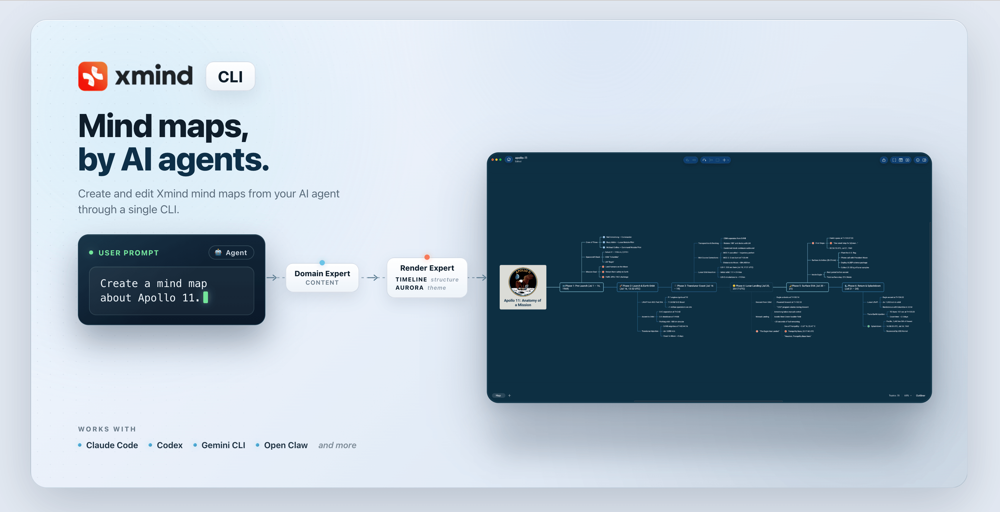

<!-- markdownlint-disable-file MD041 -->



# xmind-cli

[](https://www.npmjs.com/package/@xmindltd/xmind-cli)
[](LICENSE)

**Turn complex information into clear, native, and fully editable Xmind files with AI agents.**

Xmind CLI gives agents the core capabilities to work with local `.xmind` files. The official Xmind Skill teaches them how to organize content, choose the right structure, design the visual hierarchy, and check the result.

## Getting Started

Give this repository to an agent that supports Skills and terminal commands, then ask:

> Install Xmind Skill & CLI and verify that it is ready to use.

The agent can handle the setup. If sign-in is required, approve the browser authorization when prompted; the CLI stores the session locally.

### Instructions for the installing agent

Install both the CLI and the Skill:

```bash
npm install -g @xmindltd/xmind-cli
npx skills add xmindltd/xmind-cli -y
```

Verify the CLI and authentication status:

```bash
xmind --version
xmind auth status
```

If sign-in is required:

```bash
xmind auth login <cn|global>
```

Ask the user to complete authorization in the browser, then run `xmind auth status`
again. Once authenticated, verify the available guidance:

```bash
xmind skill list
```

Do not ask the user to run the installation commands manually unless the
environment prevents you from doing so.

### Create your first map

Once setup is complete, ask your agent:

> Create an editable Xmind map from this document and save it as `overview.xmind`.

You can also provide a topic, webpage, PDF, set of notes, or other source material available to your agent.

## Xmind Skill and CLI

Xmind is more than a way to arrange text in a tree. It is a visual thinking system for presenting hierarchy, sequence, comparison, time, cause and effect, and actionable work.

| | Role |
|---|---|
| **Xmind CLI** | Creates, reads, edits, enriches, and validates native `.xmind` files. |
| **Xmind Skill** | Guides the agent in content organization, structure selection, visual design, and quality review. |

> **The CLI lets an agent use Xmind. The Skill teaches it to use Xmind well.**

## What You Can Create

You do not need to organize everything first. If your agent can access them, local files, PDFs, images, webpages, and connected sources can all become source material.

| Give your agent | Get an editable Xmind |
|---|---|
| An article, webpage, report, or PDF | **A clear overview** of the main ideas, conclusions, and structure |
| Papers, books, course material, notes, and research sources | **A knowledge map** connecting concepts, evidence, claims, and sources |
| Meeting notes, task lists, plans, and project material | **An execution map** showing decisions, priorities, risks, and next steps |
| Product information, spreadsheets, designs, and user feedback | **A comparison or decision map** built around consistent criteria and trade-offs |
| Source code, repositories, issues, pull requests, documentation, and logs | **A system map** showing module boundaries, runtime flow, and change impact |

## Core Capabilities

- Generate rich local `.xmind` files from semantic specifications.
- Create quick maps from Markdown.
- Read and describe existing maps so they can become context for further work.
- Add, update, delete, and batch-edit topics.
- Apply structures, themes, layouts, markers, labels, links, and other visual elements.
- Attach local images, stable public raster image URLs, or Wikipedia images.
- Check generation specifications and validate completed `.xmind` files.
- Report the selected route, applied visual enhancements, fallback behavior, and Xmind credits used.

<details>
<summary>Command reference</summary>

```bash
xmind generate --spec generate.json -o output.xmind
xmind generate check --spec generate.json
xmind create --from-markdown draft.md -o output.xmind
xmind read output.xmind
xmind describe output.xmind
xmind validate output.xmind --quiet
xmind batch output.xmind --input operations.json
xmind image output.xmind --topic "Topic" --wiki "Apollo 11"
```

</details>

## How It Works

The agent provides semantic judgment; the CLI provides reliable execution.

1. The agent understands the goal, audience, and source material.
2. The Skill helps it choose an appropriate content method, structure, theme, and visual strategy.
3. The agent prepares the content and generation specification.
4. The CLI builds the native `.xmind`, applies visual enhancements and images, and validates the file.
5. The agent reviews the result, makes any necessary edits, and delivers the finished file.

This is not a one-shot conversion. The same map can be read, refined, and updated as the work develops.

<details>
<summary>Execution details</summary>

CLI JSON output records execution facts such as `route.skeletonReason`, `route.colorReason`, `anchors.applied`, `billing.consumed`, `billing.balance`, `billing.unit`, and `downgraded`.

</details>

## Beyond One-Shot Mind Map Generation

| | One-shot generation workflow | Xmind Skill & CLI |
|---|---|---|
| **Xmind capabilities** | Produces a topic hierarchy with initial styling | Works with native Xmind structures, styling, editing, images, links, and validation |
| **Structure and visual design** | Applies structure and styling during the initial generation | Selects structures and visual treatments according to the content and task |
| **Workflow** | Produces an initial result | Supports generation, inspection, validation, editing, and continued refinement |
| **Deliverable** | May require conversion or recreation for continued editing | A native local `.xmind` file ready for further editing and delivery |

## Current Scope

The currently published `xmind-file` Skill focuses on local-file workflows:

- It creates and edits local `.xmind` files; it does not provide real-time cloud collaboration.
- It can attach existing local or web images, but it does not generate AI images within this Skill.
- It requires an agent environment that can install Skills and run local commands.

## Xmind Credits

Some premium structures, themes, or recipe skills may consume Xmind credits. The CLI reports actual usage and the remaining balance. These are **Xmind credits**, not OpenAI, Codex, model, or token credits.

If credits are unavailable, the CLI may use a free fallback unless `--no-downgrade` is set.

## This Repo

This public repository distributes the agent Skill entry point:

- [`skills/xmind-file/SKILL.md`](skills/xmind-file/SKILL.md)
- [`.claude-plugin/marketplace.json`](.claude-plugin/marketplace.json)

The CLI is published separately on npm as [`@xmindltd/xmind-cli`](https://www.npmjs.com/package/@xmindltd/xmind-cli).

## Links

- [Xmind](https://xmind.com) — open and continue editing `.xmind` files
- [`@xmindltd/xmind-cli`](https://www.npmjs.com/package/@xmindltd/xmind-cli) — install the CLI
- [Agent Skills specification](https://github.com/anthropics/skills)

## License

MIT
