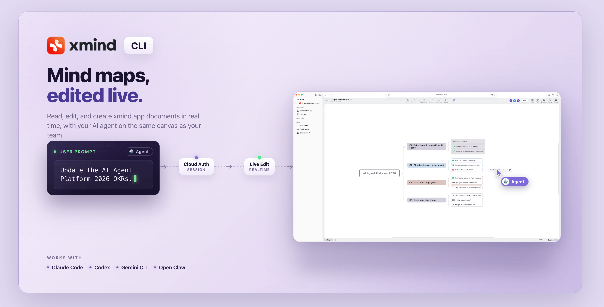
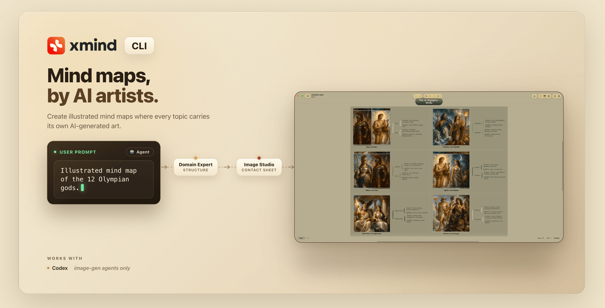

<!-- markdownlint-disable-file MD041 -->


# xmind-cli

[](https://www.npmjs.com/package/@xmindltd/xmind-cli)
[](LICENSE)

**Mind maps, by AI agents.**

Create local `.xmind` files, live-edit cloud documents on [app.xmind.com](https://app.xmind.com), and generate illustrated mind maps with AI art — all from your AI agent through a single CLI.

## Install

```bash
# 1. Install the CLI
npm install -g @xmindltd/xmind-cli

# 2. Install skills into your agent's skill directory
npx skills add xmindltd/xmind-cli -y
```

The second command auto-detects your installed agents (Claude Code, Cursor, Codex, Gemini CLI, OpenCode, Windsurf, GitHub Copilot, Antigravity) and symlinks the skill files into the right place. The `-y` flag skips confirmation prompts so the command works both in a terminal and inside AI agent environments where stdin isn't a TTY.

To install only specific skills:

```bash
npx skills add xmindltd/xmind-cli -s xmind-file,xmind-cloud -y
```

---

## What you can build

### Local `.xmind` files

Your agent plans the structure, picks a skeleton and color theme, and writes a `.xmind` file you can open in [Xmind](https://xmind.com). A Domain Expert handles content; a Render Expert handles layout and styling.

> _"Create a mind map about Apollo 11."_

**`xmind create`** / `read` / `add` / `update` / `theme` / `batch` / `image`

**Skill:** [`xmind-file`](skills/xmind-file/SKILL.md)

---

### Live editing on app.xmind.com



Read, edit, and create real-time documents on [app.xmind.com](https://app.xmind.com) — your agent appears as a co-editor on the same canvas as your team.

> _"Update the AI Agent Platform 2026 OKRs."_

**`xmind cloud open`** / `auth` / `batch` / `upload`

**Setup:** `xmind cloud auth login` once (browser auth) · **Skill:** [`xmind-cloud`](skills/xmind-cloud/SKILL.md)

---

### Mind maps with AI art



Every topic gets its own AI-generated illustration through a contact-sheet workflow — Domain Expert plans the structure, Image Studio renders all illustrations as a single composite, and the CLI slices and places each panel onto its topic.

> _"Illustrated mind map of the 12 Olympian gods."_

**`xmind image-plan`** / `enrich-images`

**Requires:** image generation (Codex) · **Skill:** [`xmind-illustrated-map`](skills/xmind-illustrated-map/SKILL.md)

---

## How it works

Skills load on demand from your agent's skill directory — they're configuration, not a separate runtime. The roles named above (Domain Expert, Render Expert, Image Studio, Cloud Auth, Live Edit) are internal stages each skill bundles; the agent runs them in sequence.

The only external piece is the CLI binary (`xmind ...`). Once skills are installed, your agent picks the right skill from your prompt and invokes the CLI directly — nothing else to configure.

---

## About this repo

This repository is the install entry — the three `SKILL.md` files distributed via `npx skills add` and the marketplace declaration in [`.claude-plugin/marketplace.json`](.claude-plugin/marketplace.json). The CLI binary and the knowledge it loads on demand ship via `npm install -g @xmindltd/xmind-cli`.

---

## Links

- [Xmind](https://xmind.com) — desktop and cloud apps that read `.xmind` files
- [`@xmindltd/xmind-cli`](https://www.npmjs.com/package/@xmindltd/xmind-cli) — the npm package
- [Agent Skills spec](https://github.com/anthropics/skills) — the format these skills follow

## License

MIT
